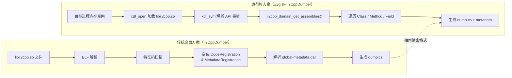
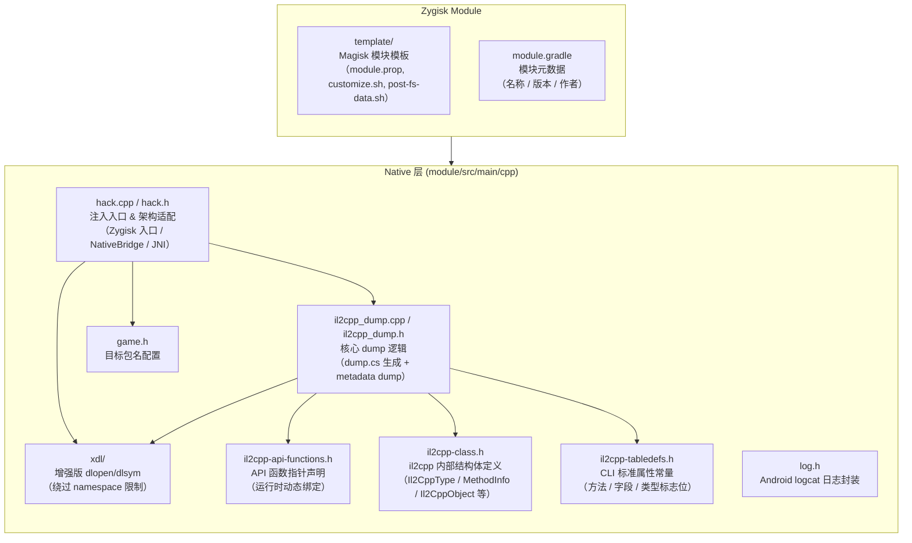
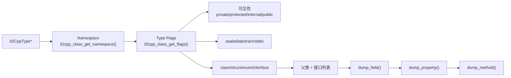
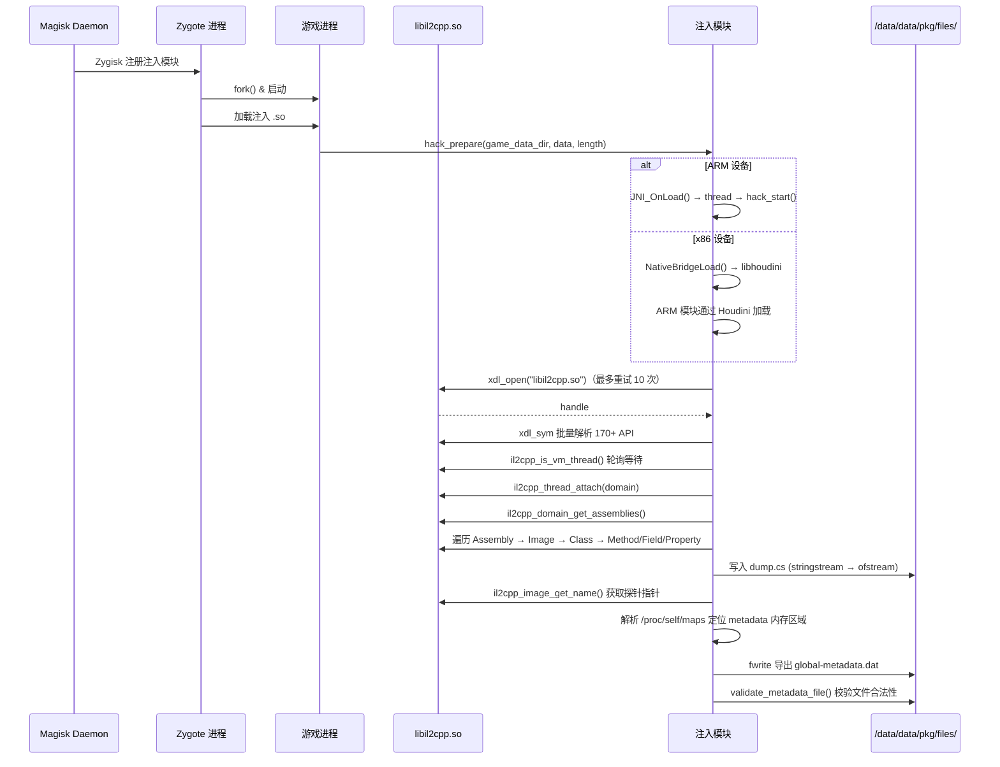
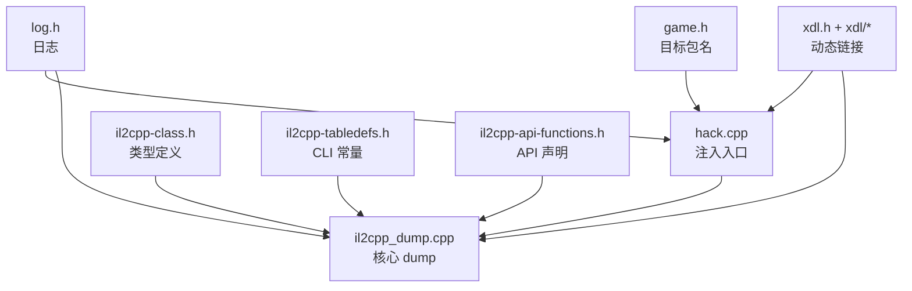

# Zygisk-Il2CppDumper 架构原理

## 目录

1. [项目概述](#1-项目概述)
2. [核心设计理念](#2-核心设计理念)
3. [模块构成与职责](#3-模块构成与职责)
4. [源码架构详解](#4-源码架构详解)
5. [执行流程](#5-执行流程)
6. [关键技术细节](#6-关键技术细节)
7. [与 Il2CppDumper 桌面版对比](#7-与-il2cppdumper-桌面版对比)
8. [输出产物](#8-输出产物)
9. [构建设计](#9-构建设计)

---

## 1. 项目概述

Zygisk-Il2CppDumper 是一款基于 **Zygisk**（Magisk 的进程注入框架）的 il2cpp 运行时数据导出工具。它在目标游戏进程启动时注入，通过调用 il2cpp 运行时 API 动态遍历所有 Assembly / Image / Class / Method / Field 元数据，生成 `dump.cs` 伪代码文件和 `global-metadata.dat` 二进制文件。

**核心优势**：因为是通过官方 API 在运行时获取数据，天然绕过所有针对 ELF 文件的保护手段——包括代码混淆、SO 加壳、符号表剥离、Metadata 加密等。

**项目主页**：[GitHub](https://github.com/Perfare/Zygisk-Il2CppDumper)  
**作者**：Perfare  
**许可证**：MIT

---

## 2. 核心设计理念



**核心差异一句话概括：**

> Il2CppDumper 静态分析 ELF 文件的**二进制结构**来定位数据；  
> Zygisk-Il2CppDumper 在进程内直接调用 **il2cpp API** 来遍历数据。

---

## 3. 模块构成与职责



### 3.1 各模块详细职责

| 模块 | 文件 | 职责 | 关键函数 / 定义 |
|------|------|------|----------------|
| **注入入口** | `hack.cpp` / `hack.h` | Zygisk 加载入口，处理 ARM/x86 架构差异，NativeBridge 桥接 | `hack_prepare()`, `hack_start()`, `NativeBridgeLoad()`, `JNI_OnLoad()` |
| **核心 dump** | `il2cpp_dump.cpp` / `il2cpp_dump.h` | 遍历所有类/方法/字段/属性，生成 dump.cs；导出 global-metadata.dat | `il2cpp_api_init()`, `il2cpp_dump()`, `il2cpp_dump_global_metadata()`, `dump_type()`, `dump_method()`, `dump_field()`, `dump_property()` |
| **API 声明** | `il2cpp-api-functions.h` | 定义所有 il2cpp API 的函数指针，通过 `DO_API` 宏在编译期展开 | `il2cpp_domain_get`, `il2cpp_class_get_methods`, `il2cpp_image_get_name` 等 170+ API |
| **类型定义** | `il2cpp-class.h` | IL2CPP 内部数据结构定义，仅在运行时通过指针读取，不依赖 Unity 头文件 | `Il2CppType`, `MethodInfo`, `Il2CppObject`, `Il2CppArray` |
| **标志位常量** | `il2cpp-tabledefs.h` | ECMA-335 CLI 规范中的 Type/Method/Field 属性常量 | `TYPE_ATTRIBUTE_PUBLIC`, `METHOD_ATTRIBUTE_STATIC`, `FIELD_ATTRIBUTE_PRIVATE` 等 |
| **目标配置** | `game.h` | 定义目标游戏的包名 | `#define GamePackageName "com.game.packagename"` |
| **日志系统** | `log.h` | Android NDK logcat 日志输出封装 | `LOGI()`, `LOGD()`, `LOGE()`, `LOGW()` |
| **动态链接** | `xdl/` | 增强版 `dlopen`/`dlsym`，支持绕过 Android 7+ 的 linker namespace 限制，提供 libhoudini 桥接 | `xdl_open()`, `xdl_sym()` |

---

## 4. 源码架构详解

### 4.1 注入入口 `hack.cpp` —— 多架构适配器

```mermaid
stateDiagram-v2
    [*] --> ZygiskLoad: Zygisk 加载 .so
    ZygiskLoad --> hack_prepare: 调用入口

    state hack_prepare {
        [*] --> CheckArch
        CheckArch --> NativeBridgeLoad: x86 设备<br/>（Intel/AMD CPU）
        CheckArch --> JNI_OnLoad: ARM 设备<br/>（直接加载）

        state NativeBridgeLoad {
            [*] --> WaitHoudini: sleep 5s
            WaitHoudini --> GetJavaVM: JNI_GetCreatedJavaVMs
            GetJavaVM --> GetLibDir: 获取 nativeLibraryDir
            GetLibDir --> IsArm: 判断是否需要桥接
            IsArm --> LoadHoudini: dlopen("libhoudini.so")
            LoadHoudini --> LoadArmModule: loadLibraryExt(path)
            LoadArmModule --> CallJNIOnLoad: getTrampoline(JNI_OnLoad)
        }

        state JNI_OnLoad {
            [*] --> NewThread: std::thread
            NewThread --> hack_start
        }
    }

    state hack_start {
        [*] --> TryOpen: xdl_open("libil2cpp.so")
        TryOpen --> OpenOK: 成功
        TryOpen --> Retry: 失败，sleep 1s
        Retry --> TryOpen: 最多重试 10 次
        OpenOK --> InitAPI: il2cpp_api_init(handle)
        InitAPI --> DoDump: il2cpp_dump(game_data_dir)
    }
```

**关键设计决策：**

1. **ARM vs x86 分叉**：运行在 x86 设备上时，利用 Android 的 NativeBridge 机制（libhoudini / libndk_translation）加载 ARM 版本的模块。`hack_prepare` 中通过 `#if defined(__i386__) || defined(__x86_64__)` 条件编译分叉：
   - **ARM 设备**：直接调用 `hack_start()`  
   - **x86 设备**：先尝试 `NativeBridgeLoad()`，失败再退回 `hack_start()`

2. **NativeBridge 加载链**（x86）：
   ```
   x86 native .so → libhoudini.so → loadLibraryExt(ARM .so) → getTrampoline(JNI_OnLoad) → JNI_OnLoad(ARM侧)
   ```
   使用 `memfd_create` + `mmap` 将 ARM 模块注入内存，通过 `/proc/self/fd/{fd}` 路径传递给 `loadLibraryExt`。

3. **重试机制**：Zygisk 注入时 `libil2cpp.so` 可能尚未加载，`hack_start()` 通过循环 `xdl_open` + `sleep(1)` 等待最多 10 秒。

### 4.2 核心 Dump 逻辑 `il2cpp_dump.cpp`

```mermaid
flowchart TB
    subgraph Phase1["阶段 1: API 初始化"]
        P1S1["xdl_open(\"libil2cpp.so\") → handle"]
        P1S2["init_il2cpp_api(handle)<br/>通过 DO_API 宏批量解析"] --> P1S3["170+ API 函数指针绑定"]
        P1S3 --> P1S4["dladdr() 获取 il2cpp_base"]
        P1S4 --> P1S5["等待 il2cpp_init 完成<br/>il2cpp_is_vm_thread()"]
        P1S5 --> P1S6["il2cpp_thread_attach(domain)"]
    end

    subgraph Phase2["阶段 2: Type 遍历"]
        P2S1["il2cpp_domain_get_assemblies()<br/>获取所有 Assembly"] --> P2S2{"Unity 版本"}
        P2S2 -->|"≥ 2018.3"| P2S3A["il2cpp_image_get_class_count()<br/>+ il2cpp_image_get_class()"]
        P2S2 -->|"&lt; 2018.3"| P2S3B["Assembly.Load() 反射<br/>Assembly.GetTypes()"]
        P2S3A --> P2S4["il2cpp_class_get_type()"]
        P2S3B --> P2S4
    end

    subgraph Phase3["阶段 3: 逐类 dump"]
        P3S1["dump_type()"] --> P3S2["命名空间 / 可见性 /<br/>继承链 / 接口"]
        P3S2 --> P3S3["dump_field()<br/>字段访问级别 + 类型 + 偏移"]
        P3S3 --> P3S4["dump_property()<br/>属性 get/set 方法"]
        P3S4 --> P3S5["dump_method()<br/>RVA + 修饰符 + 签名 + 参数"]
    end

    subgraph Phase4["阶段 4: Metadata 导出"]
        P4S1["选取第一个 Assembly 的 image name<br/>作为 metadata 探针"]
        P4S1 --> P4S2["解析 /proc/self/maps<br/>定位探针所在内存区域"]
        P4S2 --> P4S3["fwrite 导出整个区域<br/>→ global-metadata.dat"]
        P4S3 --> P4S4["validate_metadata_file()<br/>校验 magic=0xFAB11BAF &amp; version"]
    end

    Phase1 --> Phase2 --> Phase3 --> Phase4
```

**API 初始化细节**：

```cpp
// DO_API 宏展开原理
#define DO_API(r, n, p)  n = (r (*) p)xdl_sym(handle, #n, nullptr);

// 编译期展开为：
il2cpp_domain_get = (Il2CppDomain *(*)())xdl_sym(handle, "il2cpp_domain_get", nullptr);
il2cpp_class_get_name = (const char *(*)(Il2CppClass *))xdl_sym(handle, "il2cpp_class_get_name", nullptr);
// ... 共 170+ 行
```

所有 API 函数指针在运行期通过 `xdl_sym` 动态解析，**不直接链接** libil2cpp.so。这是关键设计——因为不同 Unity 版本的 libil2cpp.so ABI 不完全一致，动态解析可以最大程度兼容。

### 4.3 类型转储 `dump_type()`



生成的 dump.cs 格式示例：
```csharp
// Image 0: Assembly-CSharp
// Namespace: Game
public class Player // RVA: ...
{
    // Fields
    private int _health; // 0x10
    public static float speed; // 0x0
    
    // Properties
    public bool IsAlive { get; set; }
    
    // Methods
    // RVA: 0x1234 VA: 0x7abc1234
    public void TakeDamage(int damage) { }
    
    // RVA: 0x5678 VA: 0x7abc5678
    private static void Update() { }
}
```

### 4.4 类型定义层 `il2cpp-class.h`

定义了 il2cpp 运行时的核心数据结构（**仅包含本工具需要的字段**）：

| 结构体 | 用途 | 关键字段 |
|--------|------|----------|
| `Il2CppType` | 类型描述符 | `type:8`（类型枚举）、`byref:1`（是否引用）、`data`（具体类型数据） |
| `MethodInfo` | 方法信息 | `methodPointer`（编译后的函数地址） |
| `Il2CppObject` | 托管对象基类 | `klass`（类型指针）、`monitor`（同步锁） |
| `Il2CppArray` | 托管数组 | `max_length`（长度）、`vector[32]`（柔性数组首地址） |

这些结构体定义极为精简，仅包含实际使用的字段，避免依赖任何 Unity 版本的内部头文件。

### 4.5 API 声明层 `il2cpp-api-functions.h`

采用 X-Macro 模式，将 170+ 个 il2cpp API 统一管理：

```cpp
// 声明阶段：展开为函数指针声明
#define DO_API(r, n, p) r (*n) p
#include "il2cpp-api-functions.h"
#undef DO_API
// → Il2CppDomain* (*il2cpp_domain_get)();
// → const char* (*il2cpp_class_get_name)(Il2CppClass*);
// ...

// 初始化阶段：展开为 xdl_sym 绑定
#define DO_API(r, n, p) n = (r (*)p)xdl_sym(handle, #n, nullptr);
#include "il2cpp-api-functions.h"
#undef DO_API
```

**设计优势：**
- 单一事实来源 (Single Source of Truth)
- 添加/删除/修改 API 只需改一行
- 编译期类型安全

### 4.6 标志位常量 `il2cpp-tabledefs.h`

直接引用 ECMA-335 CLI 标准定义的 Type/Method/Field/Parameter 属性掩码常量，用于判断可访问性、存储类型、继承修饰符等。

这些值与 Unity 的 il2cpp 输出完全一致（因为 il2cpp 本身就是 CLI 到 C++ 的转换器），确保了跨版本兼容性。

---

## 5. 执行流程

### 5.1 完整时间线



### 5.2 函数调用链

```
hack_prepare()
├── [x86] NativeBridgeLoad()
│   ├── dlopen("libart.so") → JNI_GetCreatedJavaVMs()
│   ├── GetLibDir(vms) → JNI 调用 ApplicationInfo.nativeLibraryDir
│   ├── [ARM Houdini 可用] dlopen("libhoudini.so")
│   │   ├── loadLibraryExt(path, RTLD_NOW, ns=3)
│   │   └── getTrampoline("JNI_OnLoad") → JNI_OnLoad()
│   │       └── hack_start()
│   └── [回退] hack_start()
│
└── hack_start(game_data_dir)
    ├── xdl_open("libil2cpp.so") ← [重试×10]
    ├── il2cpp_api_init(handle)
    │   ├── init_il2cpp_api(handle)  ← xdl_sym 绑定 170+ API
    │   ├── dladdr() → il2cpp_base
    │   ├── il2cpp_is_vm_thread() 轮询
    │   └── il2cpp_thread_attach(domain)
    │
    └── il2cpp_dump(game_data_dir)
        ├── il2cpp_domain_get_assemblies()
        │   └── 遍历所有 Assembly
        │       ├── [≥2018.3] il2cpp_image_get_class_count() + get_class()
        │       └── [<2018.3] Assembly.Load() + GetTypes() 反射
        ├── dump_type() → dump_field() → dump_property() → dump_method()
        ├── stringstream 拼接 → ofstream 写入 dump.cs
        │
        └── il2cpp_dump_global_metadata()
            ├── 以 il2cpp_image_get_name() 返回指针为探针
            ├── 解析 /proc/self/maps 定位内存区域
            ├── fwrite 写入 global-metadata.dat
            └── validate_metadata_file() 校验 magic + version
```

---

## 6. 关键技术细节

### 6.1 xdl —— 增强版动态链接器

Android 7.0+ 引入了 linker namespace 隔离，普通 `dlopen`/`dlsym` 无法从第三方 `.so` 中符号。`xdl` 是一套增强实现：

- **xdl_open()**：支持按 SO 名搜索（无需完整路径），自动绕过 namespace 限制
- **xdl_sym()**：类似 `dlsym` 但不受 namespace 限制

### 6.2 跨架构 NativeBridge 流程

在 x86 设备上运行 ARM 游戏时（如 Intel CPU 的 Android 模拟器），需要 NativeBridge：

```
x86 Process
  └── libzygisk.so (x86, 由 Zygisk 注入)
       └── hack_prepare()
            └── NativeBridgeLoad()
                 ├── 1. dlopen("libart.so") → 获取 JavaVM 当前实例
                 ├── 2. JNI → ApplicationInfo.nativeLibraryDir → 判断是否为 x86 lib dir
                 ├── 3. dlopen("libhoudini.so") → 获取 NativeBridgeItf 回调表
                 ├── 4. memfd_create + mmap 将 ARM .so 数据写入匿名文件
                 ├── 5. callbacks->loadLibraryExt("/proc/self/fd/{fd}", ...) → 获取 ARM 句柄
                 └── 6. callbacks->getTrampoline(handle, "JNI_OnLoad") → 调用 ARM JNI_OnLoad
```

其中步骤 4 使用 Linux `memfd_create` 系统调用创建匿名内存文件，避免写入 `tmpfs`（某些设备上不可写）。

### 6.3 Unity 版本兼容

代码通过"能力检测"而非"版本检测"来兼容不同 Unity 版本：

```cpp
if (il2cpp_image_get_class) {
    // ≥ Unity 2018.3: 使用官方 API 遍历 class
    auto classCount = il2cpp_image_get_class_count(image);
    for (int j = 0; j < classCount; ++j) {
        auto klass = il2cpp_image_get_class(image, j);
    }
} else {
    // < Unity 2018.3: 通过 .NET 反射获取类型
    auto assemblyClass = il2cpp_class_from_name(corlib, "System.Reflection", "Assembly");
    auto assemblyLoad = il2cpp_class_get_method_from_name(assemblyClass, "Load", 1);
    // 直接调用 assemblyLoad->methodPointer（C# 下的 Assembly.Load）
}
```

### 6.4 RVA 计算

RVA (Relative Virtual Address) 在 dump.cs 中用于 IDA 定位函数：

```cpp
uint64_t rva = (uint64_t)method->methodPointer - il2cpp_base;
```

| 字段 | 来源 | 含义 |
|------|------|------|
| `il2cpp_base` | `dladdr(il2cpp_domain_get_assemblies).dli_fbase` | libil2cpp.so 在内存中的基址 |
| `method->methodPointer` | il2cpp 直接返回 | 编译后函数入口地址 |

### 6.5 global-metadata.dat 导出方案

**核心思路**：利用"面包屑"策略，无需了解 metadata.dat 的内部结构。

```
1. 调用 il2cpp_image_get_name(image) 
   → 返回值是指向 metadata.dat 字符串表的指针

2. 解析 /proc/self/maps，找到包含该指针的内存区域
   → 即 metadata.dat 在进程中的映射范围

3. fwrite 导出整个内存区域
   → 文件大小 = 区域大小（上限 256MB 安全截断）

4. 校验导出文件的 header：
   - magic: 0xFAB11BAF (offset 0, 4 bytes)
   - version: 16~32 (offset 4, 4 bytes)
```

**设计优势**：
- 不需要了解 metadata.dat 内部偏移布局（不同 Unity 版本不同）
- 不需要镜像基址修正
- 输出的 metadata.dat 已经是解密后的版本（运行时 il2cpp 已解密或不解密即用）

---

## 7. 与 Il2CppDumper 桌面版对比

| 对比维度 | Il2CppDumper (桌面版) | Zygisk-Il2CppDumper (本项目) |
|----------|----------------------|------------------------------|
| **运行位置** | PC，离线分析 | Android，运行时注入 |
| **输入** | libil2cpp.so + global-metadata.dat 文件 | 游戏进程内存空间 |
| **核心原理** | ELF 解析 + 特征码扫描 + metadata 二进制解码 | 直接调用 il2cpp 运行时 API |
| **代码混淆对抗** | ❌ 需先脱壳 / 去混淆 | ✅ 不受混淆影响 |
| **metadata 加密对抗** | ❌ 需解密或特征提取 | ✅ 直接读内存中的明文 |
| **符号表依赖** | 需要（特征码） | 不需要（API 直接调用） |
| **Unity 版本兼容** | 需维护签名库 | 通过 API 存在性自动适配 |
| **输出格式** | dump.cs + script.json + ida.py + ... | dump.cs + global-metadata.dat |
| **跨架构支持** | 解析 ELF，架构无关 | x86（通过 Houdini） + ARM（原生） |
| **使用门槛** | 需要 ROOT 或 SO 文件 | 需要 Magisk + Zygisk |

### 7.1 对抗能力矩阵

| 保护手段 | Il2CppDumper 桌面版 | Zygisk-Il2CppDumper |
|----------|---------------------|---------------------|
| SO 加壳 (UPX/自定义) | ❌ 需脱壳 | ✅ 运行时已解壳 |
| il2cpp 代码混淆 | ❌ 需去混淆 | ✅ 不影响 API 调用 |
| metadata.dat 加密 | ❌ 需解密 | ✅ 运行时已明文 |
| metadata 偏移随机化 | ❌ 需版本适配 | ✅ 不关心偏移 |
| 反调试检测 | — | ⚠️ 可能受影响 |
| NativeBridge 环境 | — | ✅ 完整支持 |

---

## 8. 输出产物

| 文件 | 位置 | 格式 | 用途 |
|------|------|------|------|
| `dump.cs` | `/data/data/{package}/files/` | C# 伪代码 | IDA / dnSpy / VS Code 查看游戏逻辑 |
| `global-metadata.dat` | `/data/data/{package}/files/` | 二进制 | 配合 Il2CppDumper 桌面版做深度分析 |

**dump.cs 示例结构：**
```csharp
// Image 0: Assembly-CSharp
// Dll : Assembly-CSharp

// Namespace: Game
public class Player : MonoBehaviour
{
	// Fields
	private int _health; // 0x10
	public float speed; // 0x14

	// Properties
	public bool IsAlive { get; set; }

	// Methods
	// RVA: 0x1234 VA: 0x7abc1234
	public void TakeDamage(int damage) { }
	
	// RVA: 0x5678 VA: 0x7abc5678
	private void Update() { }
}
```

---

## 9. 构建设计

### 9.1 编译系统

| 组件 | 技术 |
|------|------|
| 构建系统 | Gradle (Android) + Android NDK (CMake) |
| 最低 SDK | API 23 (Android 6.0) |
| 目标 SDK | API 32 (Android 12L) |
| 输出格式 | Magisk Module ZIP |

### 9.2 编译产物结构

```
module/build/outputs/magisk/
└── zygisk-il2cppdumper-v1.2.0-release.zip
    ├── META-INF/com/google/android/update-binary
    ├── module.prop                    # Magisk 模块元数据
    ├── customize.sh                   # 安装脚本
    ├── post-fs-data.sh                # post-fs-data 钩子
    ├── zygisk/
    │   ├── armeabi-v7a.so            # ARM 32-bit
    │   ├── arm64-v8a.so              # ARM 64-bit
    │   ├── x86.so                    # x86 32-bit（仅 stub）
    │   └── x86_64.so                 # x86-64（仅 stub）
    └── ...
```

x86 架构的 SO 文件是 stub 实现，实际代码与 ARM 共享（通过 NativeBridge 机制在 x86 设备上加载 ARM 版本）。

### 9.3 自定义构建

修改 `game.h` 中目标包名后执行：

```bash
# 命令行
./gradlew :module:assembleRelease

# Android Studio
Run Gradle Task → :module:assembleRelease
```

输出 ZIP 位于 `out/` 目录，可直接通过 Magisk 安装。

---

## 附录 A: 数据流全景图

```mermaid
flowchart TB
    subgraph Input["输入层"]
        I1["/data/data/{pkg}/files/<br/>目标输出目录"]
        I2["libil2cpp.so<br/>（进程内存空间）"]
    end

    subgraph Injection["注入层（hack.cpp）"]
        J1["Zygisk 加载 .so"]
        J2["架构判断:<br/>ARM vs x86"]
        J3["xdl_open()"]
        J4["NativeBridge 桥接<br/>（x86 only）"]
    end

    subgraph API["API 构建层（il2cpp_dump.cpp）"]
        A1["init_il2cpp_api()<br/>xdl_sym 绑定"]
        A2["il2cpp_base 计算<br/>（dladdr）"]
        A3["轮询 il2cpp_init<br/>（il2cpp_is_vm_thread）"]
        A4["il2cpp_thread_attach"]
    end

    subgraph Traversal["遍历层（il2cpp_dump.cpp）"]
        T1["Domain → Assemblies"]
        T2["Assembly → Image"]
        T3["Image → Class"]
        T4["Class → Type/Field/Property/Method"]
    end

    subgraph Format["格式化层"]
        F1["dump_type()<br/>命名空间 + 继承 + 修饰符"]
        F2["dump_field()<br/>访问级 + 类型 + 偏移"]
        F3["dump_property()<br/>get/set 方法"]
        F4["dump_method()<br/>RVA + 签名 + 参数"]
    end

    subgraph Output["输出层"]
        O1["stringstream<br/>内存拼接"]
        O2["ofstream → dump.cs"]
        O3["/proc/self/maps<br/>定位 metadata"]
        O4["fwrite →<br/>global-metadata.dat"]
        O5["validate_metadata_file()<br/>校验 header"]
    end

    Input --> Injection
    Injection --> API
    API --> Traversal
    Traversal --> Format
    Format --> Output
```



## 附录 B: 模块依赖图


