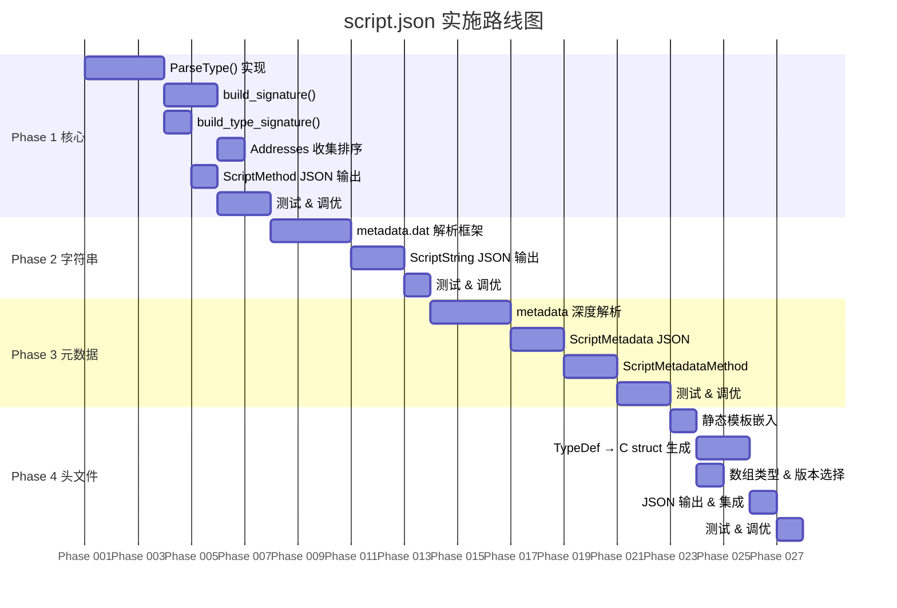
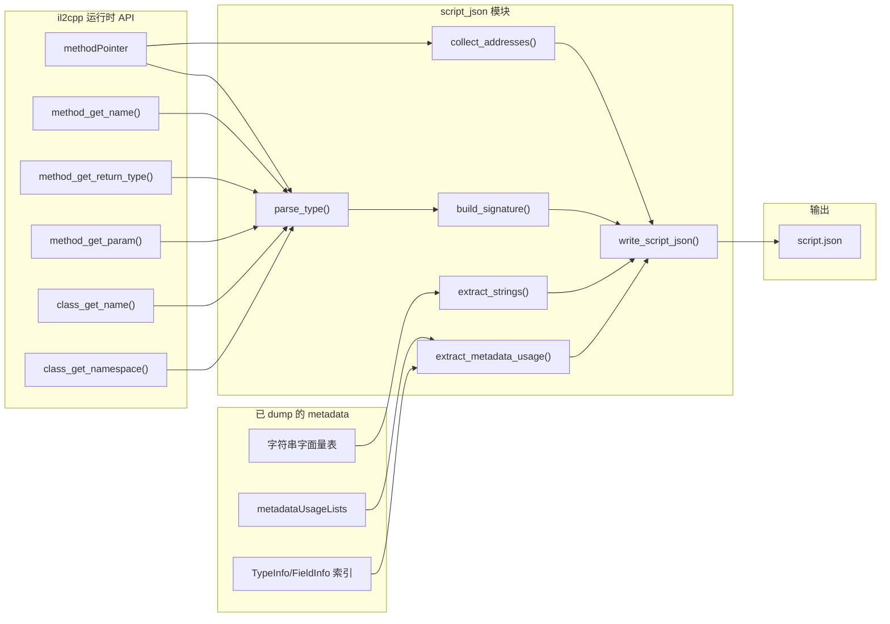

# 改造计划：添加 script.json (IDA 符号表) 输出

> **目标**：在 Zygisk-Il2CppDumper 中实现与 [Il2CppDumper](https://github.com/Perfare/Il2CppDumper) 桌面版兼容的 `script.json` 输出，使 IDA Pro 可直接导入符号表，无需借助桌面版二次处理。

---

## 目录

1. [背景与动机](#1-背景与动机)
2. [script.json 格式规范](#2-scriptjson-格式规范)
3. [现有能力评估](#3-现有能力评估)
4. [分阶段实施计划](#4-分阶段实施计划)
    - [Phase 1：ScriptMethod + Addresses（核心功能）](#phase-1scriptmethod--addresses核心功能)
    - [Phase 2：ScriptString + stringliteral.json（字符串字面量）](#phase-2scriptstring--stringliteraljson字符串字面量)
    - [Phase 3：ScriptMetadata + ScriptMetadataMethod（元数据引用）](#phase-3scriptmetadata--scriptmetadatamethod元数据引用)
    - [Phase 4：il2cpp.h（C 头文件输出）](#phase-4il2cpph-c-头文件输出)
5. [其他输出格式说明](#5-其他输出格式说明)
6. [代码架构设计](#6-代码架构设计)
7. [新文件清单](#7-新文件清单)
8. [现有文件变更清单](#8-现有文件变更清单)
9. [兼容性矩阵](#9-兼容性矩阵)
10. [风险与取舍](#10-风险与取舍)
11. [测试计划](#11-测试计划)

---

## 1. 背景与动机

### 1.1 当前工作流痛点

```
游戏 App → Zygisk-Il2CppDumper → dump.cs + global-metadata.dat
                                       ↓
                            PC 端 Il2CppDumper → script.json
                                       ↓
                                  IDA Pro 导入
```

**问题**：需要额外在 PC 上运行一次 Il2CppDumper 才能获得 IDA 符号表，且必须持有对应的 `libil2cpp.so` 文件。

### 1.2 改造后目标流程

```
游戏 App → Zygisk-Il2CppDumper → dump.cs + global-metadata.dat + script.json
                                                          ↓
                                                     IDA Pro 直接导入
```

### 1.3 可行性分析

| 数据项 | 现有能力 | 可行性 |
|--------|----------|--------|
| 方法 RVA | ✅ `methodPointer - il2cpp_base` 已实现 | 直接复用 |
| 方法名 | ✅ `il2cpp_class_get_name()` + `il2cpp_method_get_name()` | 直接复用 |
| 签名/类型 | ✅ `il2cpp_method_get_return_type()` + `il2cpp_type_get_type()` | 需实现 Il2CppType → C 类型转换 |
| 字符串字面量 | ⚠️ 需 metadata 解析 | 可从 metadata.dat 提取 |
| 元数据引用 | ⚠️ 需 metadata 解析 | 可从 metadata.dat 提取 |

---

## 2. script.json 格式规范

> 以下格式完全兼容 Il2CppDumper 桌面版的输出，可直接被 `ida.py` / `ida_py3.py` 脚本消费。

### 2.1 顶层结构

```json
{
  "ScriptMethod": [],
  "ScriptString": [],
  "ScriptMetadata": [],
  "ScriptMetadataMethod": [],
  "Addresses": []
}
```

### 2.2 ScriptMethod

每个条目描述一个方法的完整信息：

```json
{
  "Address": 12345678,
  "Name": "MyNamespace.MyClass$$MyMethod",
  "Signature": "int32_t MyNamespace_MyClass_MyMethod (MyNamespace_MyClass_o* __this, int32_t x, const MethodInfo* method);",
  "TypeSignature": "iifii"
}
```

| 字段 | 类型 | 说明 | 示例 |
|------|------|------|------|
| `Address` | `uint64` | 方法的 RVA（相对 libil2cpp.so 基址） | `0x12A4B8` |
| `Name` | `string` | `Namespace.Type$$Method` 格式 | `"Game.Player$$TakeDamage"` |
| `Signature` | `string` | 完整的 C 函数签名 | `"void Game_Player_TakeDamage (...)"` |
| `TypeSignature` | `string` | 精简类型特征码（用于二进制匹配） | `"vii"` = void(int, int) |

**TypeSignature 字符含义（沿用 Il2CppDumper 约定）：**

| 字符 | 含义 |
|------|------|
| `v` | `void` |
| `i` | 所有整数/布尔/字符/引用类型 |
| `j` | `int64_t` / `uint64_t` |
| `f` | `float` |
| `d` | `double` |

### 2.3 ScriptString

```json
{
  "Address": 9876543,
  "Value": "Hello, World!"
}
```

### 2.4 ScriptMetadata

```json
{
  "Address": 11223344,
  "Name": "System.String_TypeInfo",
  "Signature": "System_String_c*"
}
```

### 2.5 ScriptMetadataMethod

```json
{
  "Address": 55667788,
  "Name": "Method$MyNamespace.MyClass.DoSomething()",
  "MethodAddress": 12345678
}
```

### 2.6 Addresses

```json
[ 0x1000, 0x1234, 0x2000, 0x3456, ... ]
```

已排序、去重的函数入口 RVA 数组。IDA 脚本利用相邻地址对 `[Addresses[i], Addresses[i+1])` 界定函数边界。

---

## 3. 现有能力评估

### 3.1 现有代码中的数据

| 数据 | 来源 | 位置 |
|------|------|------|
| 方法入口地址 | `method->methodPointer` | `il2cpp_dump.cpp::dump_method()` (line 123) |
| `il2cpp_base` | `dladdr(il2cpp_domain_get_assemblies)` | `il2cpp_dump.cpp::il2cpp_api_init()` (line 352) |
| RVA | `methodPointer - il2cpp_base` | `il2cpp_dump.cpp::dump_method()` (line 125) |
| 返回类型 | `il2cpp_method_get_return_type(method)` | `il2cpp_dump.cpp::dump_method()` (line 139) |
| 参数列表 | `il2cpp_method_get_param(method, i)` | `il2cpp_dump.cpp::dump_method()` (line 148) |
| 方法标志位 | `il2cpp_method_get_flags(method, &iflags)` | `il2cpp_dump.cpp::dump_method()` (line 136) |
| 类名 | `il2cpp_class_get_name(klass)` | 各处 |
| 命名空间 | `il2cpp_class_get_namespace(klass)` | `il2cpp_dump.cpp::dump_type()` (line 274) |

### 3.2 需要新增的能力

| 能力 | 复杂度 | 产出 |
|------|--------|------|
| Il2CppType → C 类型字符串 | **高** | `ParseType()` C++ 实现 |
| 签名字符串拼接 | 中 | `build_signature()` |
| TypeSignature 生成 | 低 | `build_type_signature()` |
| RVA 收集与排序 | 低 | `Addresses` 数组 |
| JSON 序列化 | 低 | 手动拼接或引入轻量库 |
| 字符串字面量提取 | 中 | metadata 解析 |
| 元数据引用定位 | **高** | metadata 深度解析 |

---

## 4. 分阶段实施计划



---

### Phase 1：ScriptMethod + Addresses（核心功能）

> **目标**：生成的 script.json 包含 `ScriptMethod` 和 `Addresses` 两个部分，可供 IDA 完成函数命名和边界识别。

#### 4.1.1 格式定义

```json
{
  "ScriptMethod": [
    {
      "Address": 1835240,
      "Name": "Game.Player$$TakeDamage",
      "Signature": "void Game_Player_TakeDamage (Game_Player_o* __this, int32_t damage, const MethodInfo* method);",
      "TypeSignature": "vii"
    }
  ],
  "Addresses": [ 1835240, 1835500, 1835700, ... ],
  "ScriptString": [],
  "ScriptMetadata": [],
  "ScriptMetadataMethod": []
}
```

#### 4.1.2 设计思路

**a) ParseType() —— 核心难点**

将 Il2CppDumper C# 版本的 `StructGenerator.ParseType()` 移植为 C++，利用 `Il2CppType->type`（`Il2CppTypeEnum`）做 switch 分发：

```cpp
// 新文件: script_json.h / script_json.cpp
std::string parse_type(const Il2CppType *type) {
    switch (type->type) {
        case IL2CPP_TYPE_VOID:    return "void";
        case IL2CPP_TYPE_BOOLEAN: return "bool";
        case IL2CPP_TYPE_CHAR:    return "uint16_t";  // C# char = UTF-16
        case IL2CPP_TYPE_I1:      return "int8_t";
        case IL2CPP_TYPE_U1:      return "uint8_t";
        case IL2CPP_TYPE_I2:      return "int16_t";
        case IL2CPP_TYPE_U2:      return "uint16_t";
        case IL2CPP_TYPE_I4:      return "int32_t";
        case IL2CPP_TYPE_U4:      return "uint32_t";
        case IL2CPP_TYPE_I8:      return "int64_t";
        case IL2CPP_TYPE_U8:      return "uint64_t";
        case IL2CPP_TYPE_R4:      return "float";
        case IL2CPP_TYPE_R8:      return "double";
        case IL2CPP_TYPE_STRING:  return "System_String_o*";
        case IL2CPP_TYPE_OBJECT:  return "Il2CppObject*";
        case IL2CPP_TYPE_I:       return "intptr_t";
        case IL2CPP_TYPE_U:       return "uintptr_t";
        case IL2CPP_TYPE_PTR:     // 递归: "param_type*"
            return parse_type(type->data.type) + "*";
        case IL2CPP_TYPE_SZARRAY: // 数组类型
        case IL2CPP_TYPE_ARRAY: {
            auto elem = il2cpp_class_get_element_class(
                il2cpp_class_from_type(type));
            return fix_name(il2cpp_class_get_name(elem)) + "_array*";
        }
        case IL2CPP_TYPE_VALUETYPE: {
            auto klass = il2cpp_class_from_type(type);
            if (il2cpp_class_is_enum(klass)) {
                // enum → 获取底层类型
                return parse_type(il2cpp_class_enum_basetype(klass));
            }
            return fix_name(il2cpp_class_get_name(klass)) + "_o";
        }
        case IL2CPP_TYPE_CLASS:
        case IL2CPP_TYPE_GENERICINST: {
            auto klass = il2cpp_class_from_type(type);
            if (il2cpp_class_is_valuetype(klass)) {
                return fix_name(il2cpp_class_get_name(klass)) + "_o";
            }
            return fix_name(il2cpp_class_get_name(klass)) + "_o*";
        }
        default:
            return "Il2CppObject*";
    }
}
```

**b) FixName —— C 标识符清理**

```cpp
std::string fix_name(const std::string &name) {
    static const std::set<std::string> keywords = {
        "klass", "monitor", "register", "auto", "friend", 
        "template", "default", "unsigned", "signed", "asm",
        "if", "case", "break", "continue", "do", "new"
    };
    static const std::set<std::string> prefix_keywords = {
        "inline", "near", "far"
    };
    
    std::string result;
    for (char c : name) {
        result += (isalnum(c) || c == '_') ? c : '_';
    }
    
    if (keywords.count(result)) {
        result = "_" + result;
    }
    if (prefix_keywords.count(result)) {
        result = "_" + result + "_";
    }
    if (isdigit(result[0])) {
        result = "_" + result;
    }
    return result;
}
```

**c) build_signature() —— 完整方法签名**

```cpp
std::string build_signature(const MethodInfo *method, Il2CppClass *klass) {
    std::stringstream ss;
    
    // 返回类型
    auto ret_type = il2cpp_method_get_return_type(method);
    auto ret_str = parse_type(ret_type);
    if (ret_type->byref) ret_str += "*";
    ss << ret_str << " ";
    
    // 方法全名 (Namespace_Class_Method)
    auto ns = il2cpp_class_get_namespace(klass);
    auto cn = il2cpp_class_get_name(klass);
    auto mn = il2cpp_method_get_name(method);
    auto full = (ns ? std::string(ns) + "_" : "") + std::string(cn) + "_" + std::string(mn);
    ss << fix_name(full) << " (";
    
    uint32_t iflags = 0;
    auto flags = il2cpp_method_get_flags(method, &iflags);
    auto params = std::vector<std::string>();
    
    // 实例方法：添加 this 参数
    if (!(flags & METHOD_ATTRIBUTE_STATIC)) {
        auto this_str = parse_type(il2cpp_class_get_type(klass));
        params.push_back(this_str + " __this");
    }
    
    // 参数列表
    auto param_count = il2cpp_method_get_param_count(method);
    for (int i = 0; i < param_count; i++) {
        auto param = il2cpp_method_get_param(method, i);
        auto ptype = parse_type(param);
        if (param->byref) ptype += "*";
        auto pname = il2cpp_method_get_param_name(method, i);
        params.push_back(ptype + " " + fix_name(pname ? pname : ""));
    }
    
    // 末尾哨兵 method 参数（匹配 Il2CppDumper 行为）
    params.push_back("const MethodInfo* method");
    
    for (size_t i = 0; i < params.size(); i++) {
        if (i > 0) ss << ", ";
        ss << params[i];
    }
    ss << ");";
    return ss.str();
}
```

**d) build_type_signature()**

```cpp
std::string build_type_signature(const MethodInfo *method) {
    std::string sig;
    
    // 返回类型
    auto ret = il2cpp_method_get_return_type(method);
    sig += type_to_signature_char(ret);
    
    // 参数类型
    auto count = il2cpp_method_get_param_count(method);
    for (int i = 0; i < count; i++) {
        sig += type_to_signature_char(il2cpp_method_get_param(method, i));
    }
    return sig;
}

char type_to_signature_char(const Il2CppType *type) {
    switch (type->type) {
        case IL2CPP_TYPE_VOID: return 'v';
        case IL2CPP_TYPE_R4:   return 'f';
        case IL2CPP_TYPE_R8:   return 'd';
        case IL2CPP_TYPE_I8:
        case IL2CPP_TYPE_U8:   return 'j';
        default:               return 'i';  // 所有其他类型
    }
}
```

**e) Addresses 收集**

```cpp
std::vector<uint64_t> collect_addresses() {
    std::set<uint64_t> rvas;
    
    auto domain = il2cpp_domain_get();
    size_t asm_count;
    auto assemblies = il2cpp_domain_get_assemblies(domain, &asm_count);
    
    for (size_t i = 0; i < asm_count; i++) {
        auto image = il2cpp_assembly_get_image(assemblies[i]);
        auto class_count = il2cpp_image_get_class_count(image);
        for (size_t j = 0; j < class_count; j++) {
            auto klass = const_cast<Il2CppClass*>(il2cpp_image_get_class(image, j));
            void *iter = nullptr;
            while (auto method = il2cpp_class_get_methods(klass, &iter)) {
                if (method->methodPointer) {
                    uint64_t rva = (uint64_t)method->methodPointer - il2cpp_base;
                    rvas.insert(rva);
                }
            }
        }
    }
    
    rvas.erase(0);  // 移除空指针
    return std::vector<uint64_t>(rvas.begin(), rvas.end());
}
```

#### 4.1.3 JSON 输出方案

由于项目是纯 NDK C++ 环境，不引入第三方 JSON 库，采用**手动拼接**方案：

```cpp
std::string escape_json(const std::string &s) {
    std::string out;
    for (char c : s) {
        switch (c) {
            case '"':  out += "\\\""; break;
            case '\\': out += "\\\\"; break;
            case '\n': out += "\\n";  break;
            case '\t': out += "\\t";  break;
            default:   out += c;
        }
    }
    return out;
}

void write_script_json(const char *outDir, 
                       const std::vector<ScriptMethodEntry> &methods,
                       const std::vector<uint64_t> &addresses) {
    std::ofstream f(std::string(outDir) + "/files/script.json");
    
    f << "{\n";
    
    // ScriptMethod
    f << "  \"ScriptMethod\": [\n";
    for (size_t i = 0; i < methods.size(); i++) {
        auto &m = methods[i];
        f << "    {\n"
          << "      \"Address\": " << m.address << ",\n"
          << "      \"Name\": \"" << escape_json(m.name) << "\",\n"
          << "      \"Signature\": \"" << escape_json(m.signature) << "\",\n"
          << "      \"TypeSignature\": \"" << escape_json(m.type_sig) << "\"\n"
          << "    }" << (i < methods.size() - 1 ? "," : "") << "\n";
    }
    f << "  ],\n";
    
    // Addresses
    f << "  \"Addresses\": [\n";
    for (size_t i = 0; i < addresses.size(); i++) {
        f << "    " << addresses[i] 
          << (i < addresses.size() - 1 ? "," : "") << "\n";
    }
    f << "  ],\n";
    
    // Phase 2/3 留空数组
    f << "  \"ScriptString\": [],\n";
    f << "  \"ScriptMetadata\": [],\n";
    f << "  \"ScriptMetadataMethod\": []\n";
    f << "}\n";
}
```

#### 4.1.4 代码变更清单

| 操作 | 文件 | 说明 |
|------|------|------|
| **新增** | `module/src/main/cpp/script_json.h` | ParseType/fix_name/build_signature 声明 + ScriptMethodEntry 结构体 |
| **新增** | `module/src/main/cpp/script_json.cpp` | ParseType / fix_name / build_signature / build_type_signature / collect_addresses / write_script_json 实现 |
| **修改** | `module/src/main/cpp/il2cpp_dump.cpp` | 在 `il2cpp_dump()` 末尾调用 `write_script_json()` |
| **修改** | `module/src/main/cpp/CMakeLists.txt` | 添加 `script_json.cpp` 编译 |

---

### Phase 2：ScriptString + stringliteral.json（字符串字面量）

> **目标**：从已 dump 的 `global-metadata.dat` 中解析字符串字面量表，输出 `ScriptString` 数组。

#### 4.2.1 设计思路

Phase 1 中我们已经将 `global-metadata.dat` 导出到文件。Phase 2 从该文件读取字符串字面量信息。

**方案 A（推荐）：内存解析**

不再二次读取文件，而是在 `il2cpp_dump_global_metadata()` 中直接访问内存区域的字符串表：

```cpp
struct Il2CppGlobalMetadataHeader {
    int32_t sanity;          // 0x00
    int32_t version;          // 0x04
    int32_t stringLiteralOffset;  // 0x08  (version dependent)
    int32_t stringLiteralCount;   // 0x0C
    int32_t stringLiteralDataOffset;  // 0x10
    int32_t stringLiteralDataCount;  // 0x14
    // ... 更多字段 ...
};
```

由于 `global-metadata.dat` 的 header 结构随 Unity 版本变化较大（`stringLiteralOffset` 位置不固定），Phase 2 需要实现版本感知的偏移读取。

**方案 B（兜底）：通过 il2cpp API 获取**

利用 `il2cpp_string_new()` + `il2cpp_image_get_name()` 等方式间接获取字符串。但该方式无法获取所有字符串字面量（只能获取 `il2cpp` 暴露的部分），覆盖率有限。

**实现策略**：Phase 2 采用 A+B 混合方案：
1. 优先尝试解析 metadata header 中的 string 表（代码实现一个最小解析器）
2. 如果 Version 不在已知范围内，回退到 B 方案（通过 API 反射获取部分字符串）

```cpp
void extract_strings(const uint8_t *metadata, size_t size,
                     std::vector<StringEntry> &out) {
    auto *hdr = reinterpret_cast<const Il2CppGlobalMetadataHeader*>(metadata);
    auto version = hdr->version;
    
    // 版本感知的偏移获取
    auto [str_offset, str_count, str_data_offset, str_data_count] = 
        get_string_table_info(version, metadata);
    
    if (str_offset > 0 && str_count > 0) {
        auto str_off_table = reinterpret_cast<const int32_t*>(
            metadata + str_offset);
        auto str_data = reinterpret_cast<const char*>(
            metadata + str_data_offset);
        
        for (int i = 0; i < str_count; i++) {
            StringEntry entry;
            entry.address = il2cpp_base + str_offset + i * 4;  // offset table entry
            entry.value = std::string(str_data + str_off_table[i]);
            out.push_back(entry);
        }
    }
}
```

#### 4.2.2 stringliteral.json 同步生成

`stringliteral.json` 实际上是 `ScriptString` 数据的另一种格式化版本，数据来源完全相同，只是字段名采用小写、地址格式为十六进制字符串。在 Phase 2 实现 ScriptString 时，额外只需约 20 行代码即可同步输出。

**格式**：

```json
[
  { "value": "Hello, World!", "address": "0x12345678" },
  { "value": "PlayerData", "address": "0x12345700" }
]
```

**与 `script.json` 的 ScriptString 对比**：

| 对比项 | `script.json` 的 ScriptString | `stringliteral.json` |
|--------|------------------------------|---------------------|
| Address 格式 | 十进制整数 `12345678` | 十六进制字符串 `"0x12345678"` |
| 字段名 | `Address` + `Value` | `address` + `value`（小写） |
| 用途 | IDA Pro 自动化脚本 | 人工检索 / 离线分析 |
| 数据源 | ✅ 完全相同 | ✅ 完全相同 |

```cpp
// 在 extract_strings() 完成后，同步写出 stringliteral.json
void write_stringliteral_json(const char *outDir,
                               const std::vector<StringEntry> &strings) {
    std::ofstream f(std::string(outDir) + "/files/stringliteral.json");
    f << "[\n";
    for (size_t i = 0; i < strings.size(); i++) {
        auto &s = strings[i];
        f << "  {\n"
          << "    \"value\": \"" << escape_json(s.value) << "\",\n"
          << "    \"address\": \"0x" << std::hex << s.address << std::dec << "\"\n"
          << "  }" << (i < strings.size() - 1 ? "," : "") << "\n";
    }
    f << "]\n";
}
```

**结论**：`stringliteral.json` 零额外负担，直接并入 Phase 2。

#### 4.2.3 代码变更清单

| 操作 | 文件 | 说明 |
|------|------|------|
| **修改** | `script_json.cpp` | 添加 `extract_strings()` 函数 |
| **修改** | `script_json.h` | 添加 `StringEntry` 结构体 |
| **修改** | `script_json.cpp` | 扩展 `write_script_json()` 参数，输出 ScriptString |
| **修改** | `script_json.cpp` | 添加 `write_stringliteral_json()` 函数 |
| **修改** | `il2cpp_dump.cpp` | 传递 metadata 内存指针，调用两个输出函数 |

---

### Phase 3：ScriptMetadata + ScriptMetadataMethod（元数据引用）

> **目标**：从 metadata 中解析 TypeInfo / Il2CppType / FieldInfo / MethodDef / MethodRef 的引用条目。

#### 4.3.1 设计思路

这是实现难度最高的阶段。Il2CppDumper 桌面版依赖 metadata 的 `metadataUsageLists` 数组来定位这些引用。

**关键挑战**：
1. Metadata 结构体布局随 Unity 版本变化剧烈（字段偏移不定）
2. `metadataUsageLists` 的解码格式在不同版本间也有差异
3. 需要通过 `kIl2CppMetadataUsageTypeInfo` / `kIl2CppMetadataUsageFieldInfo` 等已知常量的位掩码区分条目类型

**实现路径**：

```cpp
void extract_metadata_refs(const uint8_t *metadata, size_t size,
                           std::vector<MetadataEntry> &metaOut,
                           std::vector<MetadataMethodEntry> &metaMethodOut) {
    auto version = get_metadata_version(metadata);
    
    // 1. 根据版本获取 metadataUsageLists 的偏移
    auto usage_offset = get_metadata_usage_offset(version, metadata);
    
    // 2. 遍历 metadataUsagePairs
    //    每个 pair 包含: usage_type (encoded selector) + usage_index
    //    usage_type 的低位决定是 TypeInfo/FieldInfo/Il2CppType/MethodDef/MethodRef
    
    // 3. 根据 usage_type 分类处理
    //    - TypeInfo → ScriptMetadata (Name="{type}_TypeInfo")
    //    - FieldInfo → ScriptMetadata (Name="Field${type}.{field}")
    //    - MethodDef  → ScriptMetadataMethod (Name="Method${type}.{method}()")
    //    - MethodRef  → ScriptMetadataMethod (泛型方法)
    
    // 4. Name 格式化规则与桌面版一致
}
```

**简化方案（可选）**：如果 metadata 版本复杂导致 Phase 3 实施困难，可考虑以下替代方案：

**替代方案 1**：仅输出 `ScriptMetadataMethod`（不输出 ScriptMetadata），利用 `il2cpp` 运行时 API 获取方法引用信息。

**替代方案 2**：生成简化版 `ScriptMetadata`，仅在已知的 TypeInfo 地址上创建命名（通过 `il2cpp_class_get_type()` 返回的类型指针间接定位），不依赖 metadata 编码格式。

#### 4.3.2 代码变更清单

| 操作 | 文件 | 说明 |
|------|------|------|
| **新增** | `script_json_metadata.h` | metadata 解析器结构体声明 |
| **新增** | `script_json_metadata.cpp` | metadata 深度解析实现 |
| **修改** | `script_json.h/cpp` | 扩展 write_script_json() 参数 |
| **修改** | `il2cpp_dump.cpp` | 调用 metadata 解析函数 |
| **修改** | `CMakeLists.txt` | 添加 meta 解析源文件 |

---

### Phase 4：il2cpp.h（C 头文件输出）

> **目标**：生成与 Il2CppDumper 桌面版兼容的 `il2cpp.h`，包含所有类型的 C 结构体定义，可直接 `#include` 到 IDA 插件或其他 C/C++ 工具中使用。

#### 4.4.1 il2cpp.h 内容拆解

```
il2cpp.h
├── ① 通用类型声明（GenericHeader）— 固定模板
│   ├── Il2CppMethodPointer, MethodInfo, VirtualInvokeData
│   ├── Il2CppType, Il2CppObject, Il2CppRGCTXData
│   └── Il2CppRuntimeInterfaceOffsetPair
│
├── ② 版本特定的 Il2CppClass / MethodInfo 定义 — 6 个版本模板
│   ├── HeaderV22  (Unity 2017.1)
│   ├── HeaderV240 (Unity 2018.1-2)
│   ├── HeaderV241 (Unity 2018.3)
│   ├── HeaderV242 (Unity 2019.x)
│   ├── HeaderV27  (Unity 2020.x)
│   └── HeaderV29  (Unity 2021.2+, 2022.x+)
│
├── ③ 每个 TypeDef 的 C 结构体（核心工作量）
│   ├── {TypeName}_Fields — 实例字段（含父类继承）
│   ├── {TypeName}_StaticFields — 静态字段
│   ├── {TypeName}_VTable — 虚表方法指针
│   ├── {TypeName}_RGCTXs — 运行时泛型上下文
│   ├── {TypeName}_c — Il2CppClass 元数据布局
│   └── {TypeName}_o — 对象实例布局（klass + monitor + fields）
│
├── ④ 数组类型结构体
│   └── {ElementName}_array — Il2CppObject + bounds + max_length + m_Items[]
│
└── ⑤ 泛型方法的 MethodInfo 结构体
    └── MethodInfo_{RVA:X} — 含版本适配的 MethodInfo 布局
```

#### 4.4.2 运行时 API 数据可用性

| il2cpp.h 需要的数据 | 可用性 | 说明 |
|---------------------|--------|------|
| 类型名 | ✅ | `il2cpp_class_get_name()` |
| 命名空间 | ✅ | `il2cpp_class_get_namespace()` |
| 父类 | ✅ | `il2cpp_class_get_parent()` |
| 是否值类型 | ✅ | `il2cpp_class_is_valuetype()` |
| 是否枚举 | ✅ | `il2cpp_class_is_enum()` |
| 字段列表 / 类型 / 偏移 / 名称 | ✅ | `il2cpp_class_get_fields()` 系列 |
| 字段属性（静态/常量） | ✅ | `il2cpp_field_get_flags()` |
| 方法列表 / slot | ✅ | `il2cpp_class_get_methods()` |
| 接口列表 | ✅ | `il2cpp_class_get_interfaces()` |
| 枚举底层类型 | ✅ | `il2cpp_class_enum_basetype()` |
| 嵌套类型 | ✅ | `il2cpp_class_get_nested_types()` |
| 泛型参数数量 | ⚠️ | 部分 Unity 版本不支持 |
| Unity 版本号 | ⚠️ | 需从 metadata header 推断 |
| RGCTX 数据 | ❌ | 无运行时 API，需 metadata 解析 |
| 泛型实例的闭合类型参数 | ❌ | `List<int>` 中的 `int` 无法从 API 直接获取 |

#### 4.4.3 设计思路

**可行部分（约 80% 的内容）**：

- ① 通用类型声明 — 纯静态字符串常量，编译时嵌入
- ② 版本特定定义 — 6 个静态模板嵌入，运行时根据 Unity 版本选择
- ③ 非泛型类型的完整结构体 — 全部通过运行时 API 可获取
- ④ 数组类型 — 通过 `il2cpp_class_get_element_class()` 获取元素类型

**简化方案（约 20% 的困难部分）**：

| 困难项 | 简化策略 |
|--------|----------|
| 泛型实例类型 | `List<int>` 退化为 `Il2CppObject*`（与 Phase 1 的 ScriptMethod 策略对齐） |
| RGCTX 结构体 | 跳过输出（不影响 IDA 逆向的主体价值） |
| 泛型方法专用 MethodInfo | 跳过，仅输出普通方法 |

#### 4.4.4 实现示例

```cpp
// 为每个 TypeDef 生成结构体
void write_type_struct(std::ofstream &f, Il2CppClass *klass) {
    auto name = fix_name(il2cpp_class_get_name(klass));
    auto ns = il2cpp_class_get_namespace(klass);
    auto full_name = (ns ? std::string(ns) + "_" : "") + std::string(name);

    // {TypeName}_Fields
    f << "struct " << full_name << "_Fields {\n";
    auto parent = il2cpp_class_get_parent(klass);
    if (parent && il2cpp_class_get_name(parent) &&
        strcmp(il2cpp_class_get_name(parent), "Object") != 0 &&
        strcmp(il2cpp_class_get_name(parent), "ValueType") != 0) {
        f << "\t" << fix_name(il2cpp_class_get_name(parent)) << "_Fields parent;\n";
    }

    void *iter = nullptr;
    while (auto field = il2cpp_class_get_fields(klass, &iter)) {
        auto fname = fix_name(il2cpp_field_get_name(field));
        auto ftype = parse_type(il2cpp_field_get_type(field));
        auto offset = il2cpp_field_get_offset(field);
        f << "\t" << ftype << " " << fname << "; // 0x" << std::hex << offset << "\n";
    }
    f << "};\n\n";

    // {TypeName}_o
    if (!il2cpp_class_is_valuetype(klass)) {
        f << "struct " << full_name << "_o {\n";
        f << "\tIl2CppObject obj;\n";
        f << "\t" << full_name << "_Fields fields;\n";
        f << "};\n\n";
    } else {
        f << "struct " << full_name << "_o : " << full_name << "_Fields {};\n\n";
    }

    // {TypeName}_VTable（虚表）
    f << "struct " << full_name << "_VTable {\n";
    iter = nullptr;
    while (auto method = il2cpp_class_get_methods(klass, &iter)) {
        uint32_t iflags;
        if (il2cpp_method_get_flags(method, &iflags) & METHOD_ATTRIBUTE_VIRTUAL) {
            auto mn = fix_name(il2cpp_method_get_name(method));
            f << "\tVirtualInvokeData " << mn << ";\n";
        }
    }
    f << "};\n\n";
}
```

#### 4.4.5 预估工作量

| 部分 | 代码行数 | 难度 |
|------|---------|------|
| 静态模板嵌入（HeaderConstants 搬运） | ~300 行 | 低 |
| TypeDef → C struct 生成 | ~400 行 | 中 |
| 数组类型生成 | ~50 行 | 低 |
| 版本选择逻辑 | ~30 行 | 低 |
| 输出整合 | ~20 行 | 低 |
| **总计** | **~800 行** | **中** |

#### 4.4.6 代码变更清单

| 操作 | 文件 | 说明 |
|------|------|------|
| **新增** | `module/src/main/cpp/il2cpp_h.h` | il2cpp.h 生成器声明 |
| **新增** | `module/src/main/cpp/il2cpp_h.cpp` | il2cpp.h 生成实现 |
| **修改** | `module/src/main/cpp/CMakeLists.txt` | 添加 `il2cpp_h.cpp` 编译 |
| **修改** | `module/src/main/cpp/il2cpp_dump.cpp` | 在 dump 末尾调用 `write_il2cpp_h()` |

---

## 5. 其他输出格式说明

### 5.1 stringliteral.json

✅ **已纳入 Phase 2**，与 ScriptString 同步生成。详见 [Phase 2](#phase-2scriptstring--stringliteraljson字符串字面量)。

### 5.2 il2cpp.h

✅ **已纳入 Phase 4**。详见 [Phase 4](#phase-4il2cpph-c-头文件输出)。

### 5.3 DummyDll

❌ **不支持**。

Il2CppDumper 桌面版的 DummyDll 生成完全依赖 [Mono.Cecil](https://github.com/jbevain/cecil)（一个 .NET 程序集读写库），在 C 结构体内存布局上构建完整的 .NET PE/COFF 格式文件。该能力在 Android NDK（纯 C/C++）环境中不具备实现可行性：

| 因素 | 说明 |
|------|------|
| Mono.Cecil 依赖 | 纯 .NET 库，无 C/C++ 等价物 |
| PE/COFF 格式复杂度 | PE 头 + CLI 元数据表（TypeRef / TypeDef / MethodDef / 等 40+ 种表） + #Strings / #Blob / #US / #GUID 堆 |
| 工作量估算 | 10,000+ 行 C++，且格式正确性极易出错 |

**然而实际上 DummyDll 的内容已经完全被 `dump.cs` 覆盖**：DummyDll 中的各个 `.cs` 文件合并起来就是 `dump.cs` 的全部类定义。项目已稳定输出 `dump.cs`，因此不需要额外实现 DummyDll。

> 💡 **替代方案**：如果确实需要 `.dll` 形式的程序集，可在 PC 端使用 Il2CppDumper 桌面版，传入文件模式下 dump 出的 `libil2cpp.so` + `global-metadata.dat` 即可生成 DummyDll。

---

## 6. 代码架构设计

### 6.1 新增模块概览

```
module/src/main/cpp/
├── script_json.h / script_json.cpp    ← 新增：script.json 生成模块
│   ├── struct ScriptMethodEntry       ← 方法条目
│   ├── struct StringEntry             ← 字符串条目 (Phase 2)
│   ├── struct MetadataEntry           ← 元数据条目 (Phase 3)
│   ├── struct MetadataMethodEntry     ← 方法引用条目 (Phase 3)
│   ├── parse_type()                   ← Il2CppType → C 类型字符串
│   ├── fix_name()                     ← C 标识符清理
│   ├── build_signature()              ← 完整 C 方法签名
│   ├── build_type_signature()         ← TypeSignature 字符串
│   ├── collect_addresses()            ← RVA 收集排序去重
│   ├── extract_strings()              ← 字符串提取 (Phase 2)
│   └── write_script_json()            ← JSON 序列化
│
├── script_json_metadata.h/cpp         ← 新增：metadata 解析 (Phase 3)
│   ├── MetadataVersionInfo            ← 版本感知偏移表
│   ├── parse_metadata_header()        ← header 解析
│   └── extract_metadata_usage()       ← usage 条目遍历
│
└── il2cpp_dump.cpp                    ← 修改：调用新模块
    └── il2cpp_dump_script_json()      ← 新增导出入口
```

### 6.2 数据流



---

## 7. 新文件清单

| 文件 | Phase | 预估行数 | 说明 |
|------|-------|---------|------|
| `script_json.h` | 1 | ~80 | 结构体 + 函数声明 |
| `script_json.cpp` | 1 | ~400 | ParseType (100行) + build_signature (80行) + collect_addresses (50行) + write_script_json (120行) + fix_name (30行) + 辅助函数 (20行) |
| `script_json_metadata.h` | 3 | ~120 | metadata 版本偏移表 + 结构体 |
| `script_json_metadata.cpp` | 3 | ~350 | metadata 解析 + extract_strings + extract_metadata_usage |
| `il2cpp_h.h` | 4 | ~60 | il2cpp.h 生成器声明 + HeaderConstants 静态模板 |
| `il2cpp_h.cpp` | 4 | ~740 | TypeDef → C struct 生成 (400行) + 静态模板 (300行) + 数组/版本选择 (40行) |
| **总计** | — | **~1,750** | |

---

## 8. 现有文件变更清单

| 文件 | Phase | 变更类型 | 变更内容 |
|------|-------|----------|----------|
| `CMakeLists.txt` | 1 | 修改 | 添加 `script_json.cpp` 编译 |
| `il2cpp_dump.cpp` | 1 | 修改 | `il2cpp_dump()` 末尾调用 `write_script_json()` |
| `il2cpp_dump.h` | 1 | 修改 | 添加 `il2cpp_dump_script_json()` 声明 |
| `CMakeLists.txt` | 3 | 修改 | 添加 `script_json_metadata.cpp` |
| `il2cpp_dump.cpp` | 3 | 修改 | 传递 metadata 内存指针 |
| `CMakeLists.txt` | 4 | 修改 | 添加 `il2cpp_h.cpp` 编译 |
| `il2cpp_dump.cpp` | 4 | 修改 | 调用 `write_il2cpp_h()` |

### 8.1 `il2cpp_dump.cpp` 变更伪代码

```cpp
// 在 il2cpp_dump() 末尾添加（Phase 1）:

LOGI("write script.json");
auto methods = collect_script_methods();  // 遍历所有方法
auto addresses = collect_addresses();
write_script_json(outDir, methods, addresses);
LOGI("script.json done!");

// Phase 2 扩展:
LOGI("write script.json (with strings)");
auto methods = collect_script_methods();
auto addresses = collect_addresses();
auto strings = extract_strings(metadata_ptr, metadata_size);  // 新增
write_script_json(outDir, methods, addresses, strings);
LOGI("script.json done!");

// Phase 3 扩展:
auto meta = extract_metadata_refs(metadata_ptr, metadata_size);
auto meta_methods = extract_metadata_methods(metadata_ptr, metadata_size);
write_script_json(outDir, methods, addresses, strings, meta, meta_methods);

// Phase 4 扩展:
LOGI("write il2cpp.h");
write_il2cpp_h(outDir);
LOGI("il2cpp.h done!");
```

---

## 9. 兼容性矩阵

### 9.1 Unity 版本兼容

| Unity 版本 | metadata Version | Phase 1 | Phase 2 | Phase 3 | Phase 4 |
|------------|-----------------|---------|---------|---------|---------|
| 5.x (v16-20) | 16-20 | ✅ API 兼容 | ⚠️ 需适配偏移 | ❌ 暂不支持 | ⚠️ 仅模板 |
| 2017.x (v21-23) | 21-23 | ✅ | ⚠️ 需适配偏移 | ❌ 暂不支持 | ⚠️ 仅模板 |
| 2018.1-2018.2 (v24.0) | 24.0 | ✅ 反射路径 | ✅ | ⚠️ 偏移验证 | ✅ |
| 2018.3-2019.x (v24.1-v24.5) | 24.1-24.5 | ✅ API 路径 | ✅ | ⚠️ 偏移验证 | ✅ |
| 2020.x (v27) | 27 | ✅ | ✅ | ✅ 目标版本 | ✅ |
| 2021.x (v27/v29) | 27-29 | ✅ | ✅ | ✅ 目标版本 | ✅ |
| 2022.x+ (v29+) | 29+ | ✅ | ✅ | ✅ 目标版本 | ✅ |

### 9.2 架构兼容

| 架构 | Zygisk 注入 | NativeBridge | script.json 输出 | il2cpp.h 输出 |
|------|-------------|--------------|-------------------|---------------|
| ARM64 (arm64-v8a) | ✅ | N/A | ✅ | ✅ |
| ARM32 (armeabi-v7a) | ✅ | N/A | ✅ | ✅ |
| x86_64 (模拟器) | ✅ (Houdini) | ✅ | ✅ | ✅ |
| x86 (模拟器) | ✅ (Houdini) | ✅ | ✅ | ✅ |

### 9.3 IDA 脚本兼容

| 脚本 | 兼容性 |
|------|--------|
| `ida.py` (Python 2) | ✅ 完全兼容 |
| `ida_py3.py` (Python 3) | ✅ 完全兼容 |
| `ida_with_struct.py` | ✅ 需要 Phase 3 ScriptMetadata |

---

## 10. 风险与取舍

### 10.1 技术风险

| 风险 | 影响 | 缓解措施 |
|------|------|----------|
| metadata header 偏移随版本剧烈变化 | Phase 2/3 覆盖不全 | 从实测最多的 2020-2022 版本入手，逐步扩展 |
| 泛型方法类型解析不完整 | 签名信息缺失部分方法 | 标注 `// TODO`，后续通过 context 传递增强 |
| JSON 手动拼接出现转义错误 | IDA 解析失败 | 严格的 `escape_json()` 测试 |
| 超大游戏（数万类）导致 JSON 过大 | 文件体积超标 | 无（JSON 必须完整），但实测 10 万方法约 30MB，可接受 |
| il2cpp.h 泛型类型退化 | 部分结构体字段为 Il2CppObject* | 不影响 IDA 逆向主体价值，后续可增强 |

### 10.2 设计取舍

| 决策点 | 选择 | 理由 |
|--------|------|------|
| JSON 库 | 手动拼接 | 避免引入第三方依赖，保持轻量 |
| metadata 解析策略 | 内存解析（不读文件） | 减少 IO，利用 `il2cpp_dump_global_metadata()` 已有的内存映射 |
| 方法名格式 | `Namespace.Type$$Method` | 与 Il2CppDumper 严格一致，确保工具链兼容 |
| 签名中的 `method` 哨兵参数 | 保留 | 与桌面版输出一致，IDA 脚本依赖 |
| 不支持版本回退 | 最低 Unity 5.x | Phase 1 通用；Phase 2/3 只保证 2020+ |

---

## 11. 测试计划

### 11.1 单元测试（WSL Ubuntu）

> **测试环境**：WSL Ubuntu 24.04 + g++ 13.3 + cmake
>
> 由于项目核心代码依赖 Android NDK 和 Zygisk 注入环境，无法在 Windows 上直接运行。
> 采用**分层测试策略**：纯函数逻辑在 WSL 本地测试，集成测试在真机上验证。

#### 11.1.1 测试架构

```
tests/
├── CMakeLists.txt              ← 独立 CMake，g++ 编译，不依赖 NDK
├── stubs/                      ← 替代 Android 依赖的桩头文件
│   ├── log.h                   ← 假的 Android logcat（→ printf）
│   ├── il2cpp-class.h          ← 类型定义壳（Il2CppTypeEnum 等，完整复用）
│   ├── il2cpp-tabledefs.h      ← 直接复用原文件（纯常量，无 Android 依赖）
│   └── xdl.h                   ← 空桩（script_json 不调用 xdl）
├── test_fix_name.cpp           ← fix_name() 单元测试
├── test_escape_json.cpp        ← escape_json() + JSON 输出格式测试
├── test_type_signature.cpp     ← type_to_signature_char() + build_type_signature()
└── test_runner.cpp             ← 汇总测试入口
```

**编译方式**：

```bash
cd /mnt/d/Github/Zygisk-Il2CppDumper/tests
mkdir -p build && cd build
cmake .. -DCMAKE_CXX_COMPILER=g++-13
cmake --build .
./test_runner
```

#### 11.1.2 测试项清单

```
测试项：
├── Phase 1 (纯函数，WSL 本地可测)
│   ├── fix_name() C++ 关键字冲突 (register → _register, class → _class, ...)
│   ├── fix_name() 数字开头 (123abc → _123abc)
│   ├── fix_name() 特殊字符 (my-method$param → my_method_param)
│   ├── fix_name() 正常名称不变 (Player_TakeDamage → Player_TakeDamage)
│   ├── escape_json() 双引号 / 反斜杠 / 换行 / 制表符转义
│   ├── escape_json() 正常字符串不变
│   ├── type_to_signature_char() void→v, float→f, double→d, int64→j, 其他→i
│   ├── build_type_signature() 多参数组合 (void(int, float) → "vif")
│   ├── JSON 输出格式验证 (手工构造 ScriptMethodEntry → 写文件 → python 解析)
│   └── Addresses 去重排序验证 (手工构造含重复/乱序地址 → 输出有序唯一)
│
├── Phase 2 (部分可 WSL 测)
│   ├── metadata header sanity/version 校验逻辑
│   ├── 字符串表偏移计算
│   └── stringliteral.json 格式验证
│
├── Phase 3 (需真机)
│   ├── metadataUsageList 解析
│   ├── TypeInfo / FieldInfo / MethodDef 分类
│   └── 泛型方法 metadata 处理
│
└── Phase 4 (部分可 WSL 测)
    ├── HeaderConstants 模板输出（静态字符串）
    ├── TypeDef → C struct 生成（需 mock Il2CppClass）
    └── 版本自动选择逻辑
```

#### 11.1.3 桩文件说明

| 桩文件 | 替代的原文件 | 策略 |
|--------|------------|------|
| `stubs/log.h` | `module/src/main/cpp/log.h` | 用 `printf`/`fprintf` 替代 `__android_log_print` |
| `stubs/il2cpp-class.h` | `module/src/main/cpp/il2cpp-class.h` | 直接复用原文件（纯类型定义，无 Android 依赖） |
| `stubs/il2cpp-tabledefs.h` | `module/src/main/cpp/il2cpp-tabledefs.h` | 直接复用原文件（纯常量宏） |
| `stubs/xdl.h` | `module/src/main/cpp/xdl/include/xdl.h` | 空桩，script_json 不调用 xdl |
| `stubs/il2cpp-api-functions.h` | `module/src/main/cpp/il2cpp-api-functions.h` | 测试时不展开 DO_API 宏，用 mock 函数指针替代 |

### 11.2 集成测试（真机）

| 测试用例 | Unity 版本 | 架构 | 验证项 |
|----------|-----------|------|--------|
| 简单 Unity Demo | 2021.3 LTS | ARM64 | script.json 可被 ida_py3.py 导入 |
| 混淆过的商业游戏 | 2020.3 | ARM64 | 方法数量与 dump.cs 一致 |
| 模拟器测试 | 2022.2 | x86_64 (Houdini) | NativeBridge 路径生成正常 |
| 大型项目（>5000 类） | 2021.3 | ARM64 | 文件输出完整，无截断 |
| il2cpp.h 编译 | 2021.3 | ARM64 | il2cpp.h 可通过 C 编译器语法检查 |

**真机测试自动化脚本**（项目根目录 `test_deploy.ps1`）：

```powershell
# 1. 构建
.\gradlew :module:assembleRelease
# 2. 推送到手机
adb push out/zygisk-il2cppdumper-*.zip /sdcard/
# 3. Magisk 安装（需手动）
# 4. 启动游戏
adb shell "am force-stop <包名>"
adb shell "monkey -p <包名> -c android.intent.category.LAUNCHER 1"
Start-Sleep -Seconds 15
# 5. 拉取输出
adb pull "/data/data/<包名>/files/" .\test_output\
# 6. 验证
python -c "import json; json.load(open('test_output/files/script.json'))"
```

### 11.3 验证命令

```bash
# 1. 检查 JSON 格式合法性
python3 -c "import json; json.load(open('script.json'))"

# 2. 对比方法数量
python3 -c "
import json
j = json.load(open('script.json'))
print(f'ScriptMethod: {len(j[\"ScriptMethod\"])}')
print(f'Addresses:   {len(j[\"Addresses\"])}')
print(f'ScriptString: {len(j[\"ScriptString\"])}')
"

# 3. 验证 Addresses 已排序且无重复
python3 -c "
import json
j = json.load(open('script.json'))
a = j['Addresses']
assert a == sorted(set(a)), 'Addresses not sorted/unique!'
assert 0 not in a, 'Addresses contains null!'
print('Addresses OK')
"

# 4. 验证所有 ScriptMethod.Address 在 Addresses 中
python3 -c "
import json
j = json.load(open('script.json'))
addrs = set(j['Addresses'])
missing = [m for m in j['ScriptMethod'] if m['Address'] not in addrs]
print(f'Missing from Addresses: {len(missing)}')
"
```

---

## 附录：与 Il2CppDumper 桌面版输出的差异说明

| 项目 | 桌面版 Il2CppDumper | 本项目 (Zygisk) | 说明 |
|------|--------------------|--------------------|------|
| `ScriptMethod.Address` | ELF 文件偏移 | `methodPointer - il2cpp_base` | 运行时内存地址转 RVA，结果一致 |
| `ScriptString.Address` | ELF 文件偏移 | `il2cpp_base + metadata_offset` | 需要还原字符串在 metadata 中的偏移 |
| `Addresses` 来源 | CodeRegistration + 各类指针表 | 运行时遍历所有 methodPointer | 运行时版本可能包含 JIT 新增函数，更多但兼容 |
| 泛型方法签名 | 通过 metadata context 解析 | `Il2CppObject*` 占位 | 运行时 type->type 可能为 IL2CPP_TYPE_VAR，缺失具体类型信息 |
| `il2cpp.h` 输出 | ✅ 支持 | ✅ Phase 4 实现 | 通过运行时 API 生成 C 结构体，泛型部分有退化 |
| `stringliteral.json` | ✅ 支持 | ✅ Phase 2 实现 | 与 ScriptString 同步生成，零额外成本 |
| `DummyDll/` | ✅ 支持 | ❌ 不支持 | 需 Mono.Cecil（.NET 库），运行时不具可行性；且内容已被 dump.cs 完全覆盖 |
